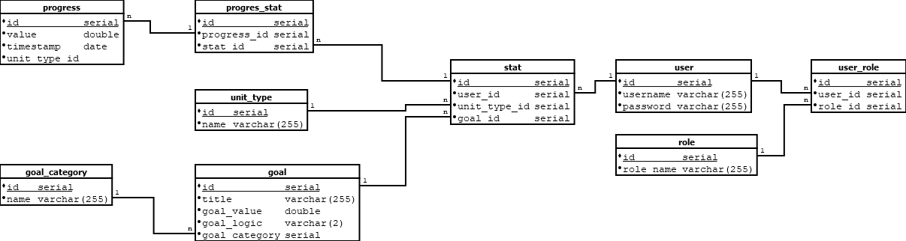
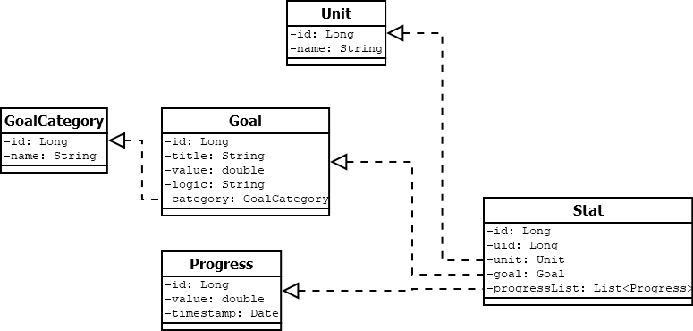
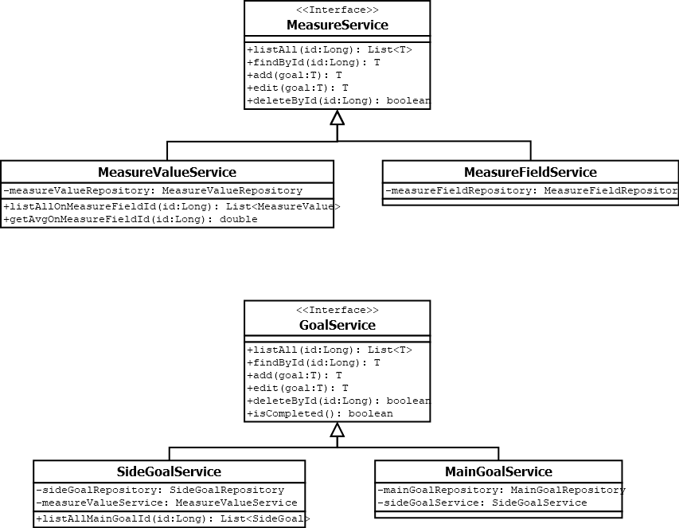

# Concept plan

This solution tracks measures instead of a title and cycle based solutions. Measures can be reused to, set new goals on them.
This way results can be put in numbers, and can be displayed in interactive manners.

# Frontend plan
[Adobe Xd Plan] https://xd.adobe.com/view/2a28a59f-8507-40fc-b803-01e73fca0d01-7f7b/?fullscreen

# Build plan

## Database

## Entities

## Services

# Install instructions

1. Build the Dockerfile in root folder with `docker build -t habitgoals .` - *This creates an image with habitgoals tag*
2. Start the application from the `./docker` folder with `docker-compose up -d` - *Don't forget to start Docker*